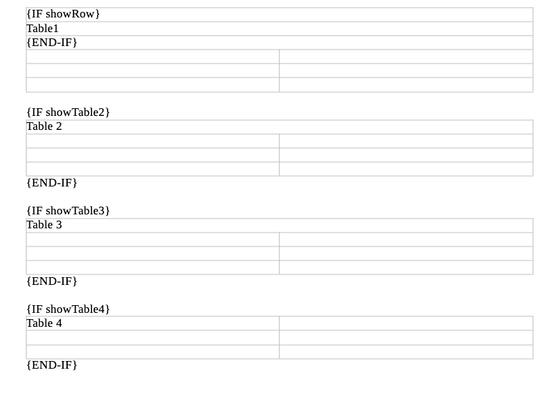
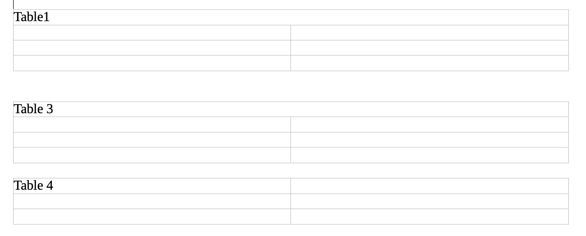
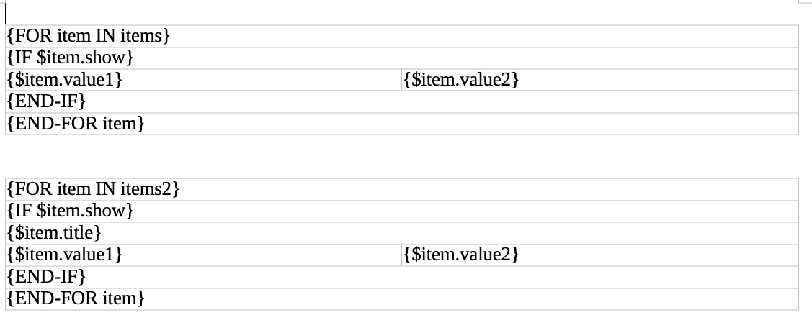
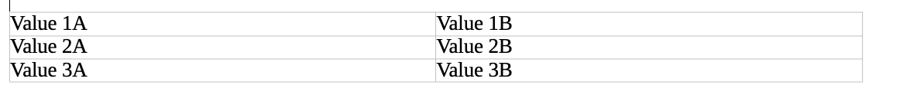

# PDF GENERATOR USING DOCX-TEMPLATE

This is just a repo for researching DOCX content manipulation

## Setup

Either run with:

npm / node:

``` shell
npm install
node ace serve
```

docker:

``` shell
docker-compose build
docker-compose up
```

## Docx-template

### Basic Hello world


### Basic If-else

** showTable2 is set to false in this case (showTable2 = false)

```typescript
export const conditionalTest = {
  showRow: true,
  showTable2: false,
  showTable3: true,
  showTable4: true,
}
```






### Basic Loop + Conditions

** items 2 is not initialized so it is omitted after processing.

```typescript
export const loopTest = {
  items: [
    { show: false, value1: 'Header' },
    { show: true, value1: 'Value 1A', value2: 'Value 1B' },
    { show: true, value1: 'Value 2A', value2: 'Value 2B' },
    { show: true, value1: 'Value 3A', value2: 'Value 3B' },
  ],
}
```



